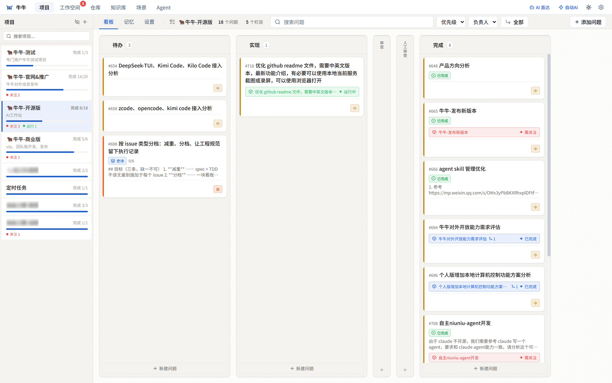
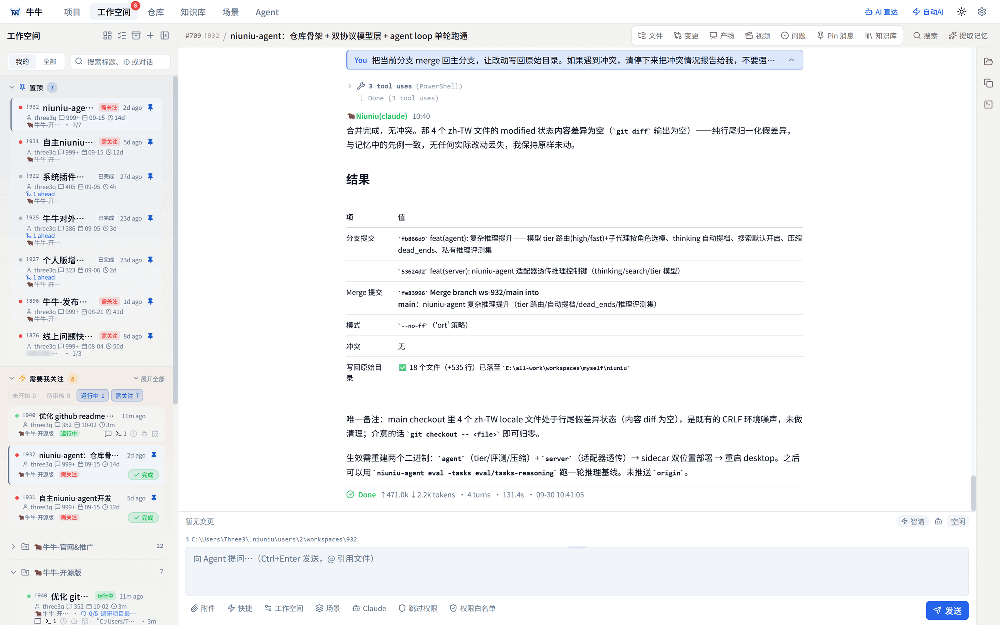
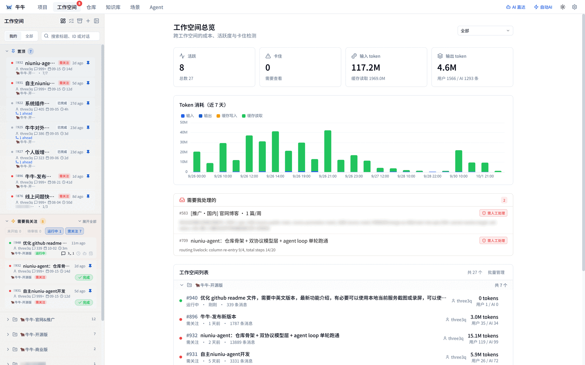
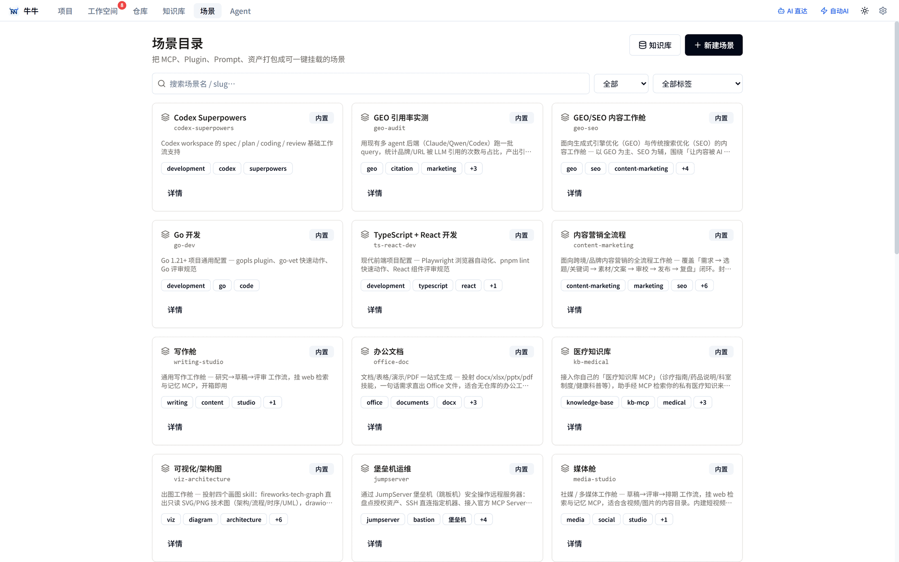

<div align="center">


# 牛牛 AI · Niuniu

**本地优先的 AI 工作站 —— 让一群编码 Agent 跨项目、跨仓库并行干活。**

一切都在你自己的机器上运行，数据落本地数据库。除非你主动接入外部数据源，否则没有任何数据离开本机。

[](https://github.com/threeq/niuniu/actions/workflows/ci.yml)
[](LICENSE)
[](https://go.dev)
[](CONTRIBUTING.md)

[English](README.md) · **简体中文**

</div>

> **授权说明** —— 本仓库采用 **Source-Available（源码可用）** 授权，并非 MIT/OSI 开源。
> 个人 / 非商业用途免费；**商用或团队 / 组织使用需取得商业授权**，详见 [LICENSE](LICENSE)。

---

牛牛最初只是为了并行驱动多个 Claude Code 会话，如今已成长为一个通用的 **AI 工作平台**。
你创建**项目**（问题看板），挂上**仓库**，再为问题开启**工作空间**——每个工作空间是独立目录，
为每个挂载仓库检出各自的 git worktree——然后在工作空间里跑一个 Agent 把活干完。
支持七种 Agent 引擎，包括随桌面端内置的**自研引擎 niuniu-agent**（零第三方依赖的 Go Agent）。

工作空间不只能写代码。通过**场景**（一键挂载的声明式工作模式），同一个工作空间可以变成
办公舱（Word/Excel/PPT）、数据驾驶舱（连库查询、Pin 实时看板）、设计/画图工作台、
写作/调研工位，或客服坐席。

> 本仓库是**源码可用的个人版**（单用户，个人 / 非商业用途免费）。另有一个独立的**企业版**，
> 提供多租户团队、云端中继与席位授权——商用或团队 / 组织使用需要授权，详见[企业版](#企业版)。

## 界面截图

| 项目看板 | 工作空间与 Agent |
|:---:|:---:|
|  |  |
| **每个项目一块看板** —— 问题在列间流转（待办 → 实现 → 审查 → 人工审查 → 完成），每个问题都能拉起自己的 Agent 工作空间。 | **工作空间** —— 独立 worktree + Agent 对话：工具时间线、计划、清单、token 用量与变更审阅。 |

| 工作空间总览 | 场景目录 |
|:---:|:---:|
|  |  |
| **总览驾驶舱** —— 跨工作空间的活跃度、卡住检测与 token / 成本统计。 | **场景目录** —— 27 个内置工作模式，覆盖开发、办公、数据、内容、营销、知识与运维。 |

## 核心功能

- **并行工作空间 + git worktree 隔离** —— 每个工作空间是独立目录，为每个挂载仓库检出各自的 worktree；IDE 视图内置终端、文件树、git 面板、diff 查看器、产物与 AI 对话。并行干活互不打架。
- **项目与看板管理** —— 问题、列、清单、评论、标签；**Epic** 支持统一 epic 分支与合并回主分支流程；执行计划与 **autohost 自动托管**（无人值守看门狗，持续驱动 Agent 直到达成问题的目标条件）。
- **七种 Agent 引擎** —— 内置 **niuniu-agent**（零依赖 Go、ACP 协议、流式思考、MCP 客户端、技能、子 Agent、原生记忆、自动压缩、自进化实验），另有 **Claude Code**、**Codex**、**Qwen Code**、**Cursor**、**Goose** 与 **omp**。
- **任意模型，按工作空间绑定** —— 通过工作空间级的环境变量 Provider，把引擎指向任意 Anthropic / OpenAI 兼容端点（GLM、DeepSeek、Kimi、MiniMax、Ollama、自建网关），模型与思考档位可按工作空间选择。
- **场景（27 个内置）** —— 一键把精选的 MCP 服务器、插件、技能、环境预设与工作约定投射进工作空间：开发（Go / TS+React / 通用）、办公（文档、邮件、写作、海报、架构图、媒体舱）、数据分析、知识库（法律 / 医疗 / 电商 / 自定义）、营销与 GEO、堡垒机运维、客服支持、文件批量处理。
- **办公与内容生成** —— 一句话直出 Word / Excel / PPT / PDF / Markdown，图表（draw.io / Excalidraw / 架构图）、海报与落地页，以及短视频流水线（素材分级、报价留痕、质量闸门），由可选的 video-gen MCP（TTS / 文生图 / 图生视频 / 合成）支撑。
- **数据智能** —— 在严格的授权范围与读写权限模型下接入 SQL（MySQL/PostgreSQL/ClickHouse 等）、Redis、MongoDB、Elasticsearch 与 HTTP 数据源；由 Agent 写查询、渲染图表，并 Pin 成可反复重跑的实时数据看板。
- **知识与记忆** —— 把本地文档（PDF / Office / 文本）灌入可检索的知识库；从会话中沉淀版本化的项目记忆（经验、坑、决策）；内置引擎还维护自己的分层记忆。
- **定时任务与主动工作流** —— cron 定时的托管工作空间、IM 机器人渠道（飞书 / 钉钉 / 企业微信 / 微信 / Telegram）、待办收件箱，以及资讯雷达场景做过滤后的摘要推送。
- **成本与 Token 统计** —— 按工作空间记账（输入 / 输出 / 缓存读 / 缓存写），token 消耗图表与卡住工作空间检测。
- **多端原生客户端** —— Tauri v2 桌面端（Windows / macOS / Linux，内置服务端与 niuniu-agent 侧车）、React Native 移动端（Expo Router），以及浏览器 UI。

## 架构

```
niuniu/
├── server/         # Go 后端 + 内嵌 React SPA
│   ├── cmd/        # API 服务端 + MCP 服务端
│   ├── internal/   # api → service → store（SQLite 或 PostgreSQL）
│   └── web/        # React 19 + TypeScript + Vite
├── agent/          # niuniu-agent —— 内置的零依赖 Go Agent（独立模块）
├── desktop-v2/     # Tauri v2 原生壳（打包服务端 + Agent 侧车）
├── mobile/         # React Native + Expo Router
├── go-shared/      # 跨二进制共享库（协议、配对加密、版本）
├── docs/           # 设计系统、规格、场景文档、截图
└── Makefile        # 根构建入口
```

**后端**：Go 1.25 · Gin · sqlc · SQLite（`modernc.org/sqlite`，无 CGO）/ PostgreSQL · gorilla/websocket · creack/pty
**Agent**：Go，零第三方依赖 · Anthropic `/v1/messages` + OpenAI `/chat/completions` 双协议 · ACP（Agent Client Protocol）
**前端**：React 19 · TypeScript · Vite · TanStack Router/Query · Zustand · shadcn/ui · Tailwind CSS 4 · xterm.js

## 快速开始

### 环境要求

- Go 1.25+
- Node.js 18+ 与 pnpm
- Git

### 构建与运行

```bash
# 后端 + 前端并行（开发模式）
make dev

# 或分开跑：
make dev-backend     # Go 服务端 :3000
make dev-frontend    # Vite 开发服务器 :5173（代理 /api + /ws 到 :3000）

# 生产构建
make build           # 构建 server + MCP 二进制到 bin/
```

**桌面端**（把服务端打包成原生应用 —— desktop-v2，Tauri）：

```bash
make build-personal-v2-current  # 当前平台
make build-personal-v2-windows  # Windows .exe
# macOS / Linux 需各自的 SDK —— 见 Makefile
```

预构建安装包（Windows `.exe`、macOS `.dmg`、Linux `.AppImage`）发布在 GitHub Releases；
在线版本与文档见 [niu6ai.com](https://niu6ai.com)。

### 运行时可选依赖（按需启用）

- **Tesseract OCR** —— 为 `read_image` 启用文字提取（未安装时回退到模型视觉）
- **Claude Code / Codex / Qwen Code / Cursor / Goose / omp CLI** —— 在工作空间内驱动的外部 Agent 引擎（内置 niuniu 引擎不需要它们）

## 配置

默认配置位于 `~/.niuniu/config.yaml`；SQLite 数据库位于 `~/.niuniu/niuniu.db`。
同时支持 PostgreSQL —— 参见 `config-postgres.example.yaml`。

## 企业版

本仓库是源码可用的**个人版**（单用户，个人 / 非商业用途免费）。独立的**企业版**额外提供：
多租户团队（`user`/`org` 归属，存储 / 流式 / MCP 隔离）、云端中继（账号鉴权、设备配对、多节点隧道）
与席位授权。商业代码不在本仓库。**将本软件用于商业或团队 / 组织用途需要付费授权** —— 详见 [LICENSE](LICENSE)。

## 参与贡献

欢迎贡献！请先阅读 [CONTRIBUTING.md](CONTRIBUTING.md)，较大的改动请先开 issue 讨论。
参与即表示你同意遵守[行为准则](CODE_OF_CONDUCT.md)。

## 安全

发现漏洞？请阅读 [SECURITY.md](SECURITY.md) 了解负责任披露流程。

## 授权

[Source-Available (NSL)](LICENSE) © 2026 threeq —— 个人 / 非商业用途免费；
商用或团队 / 组织使用需付费授权。
