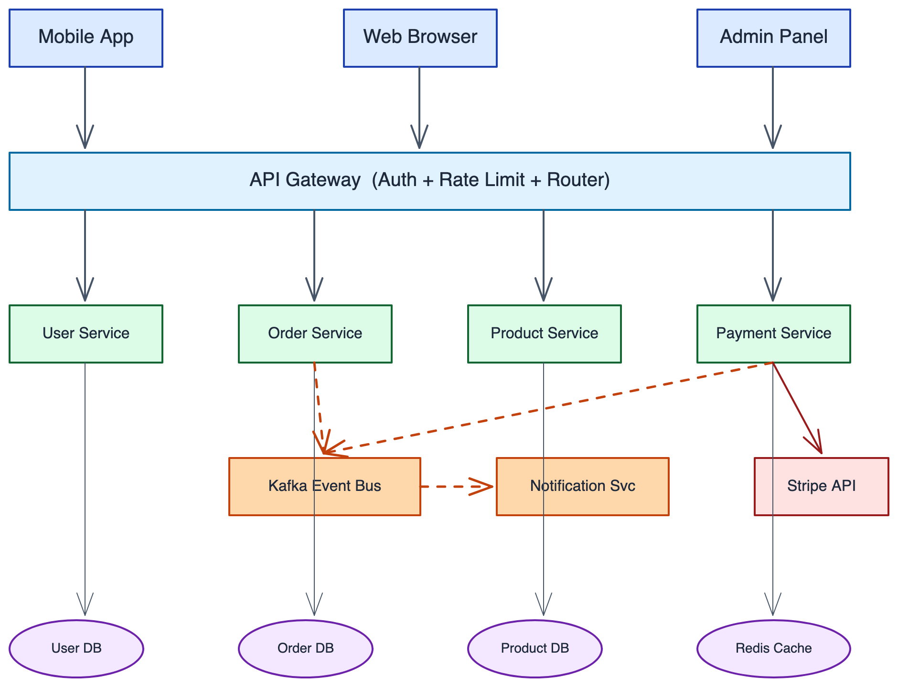
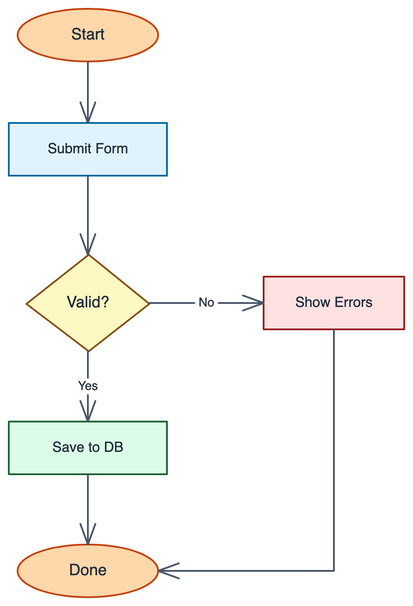
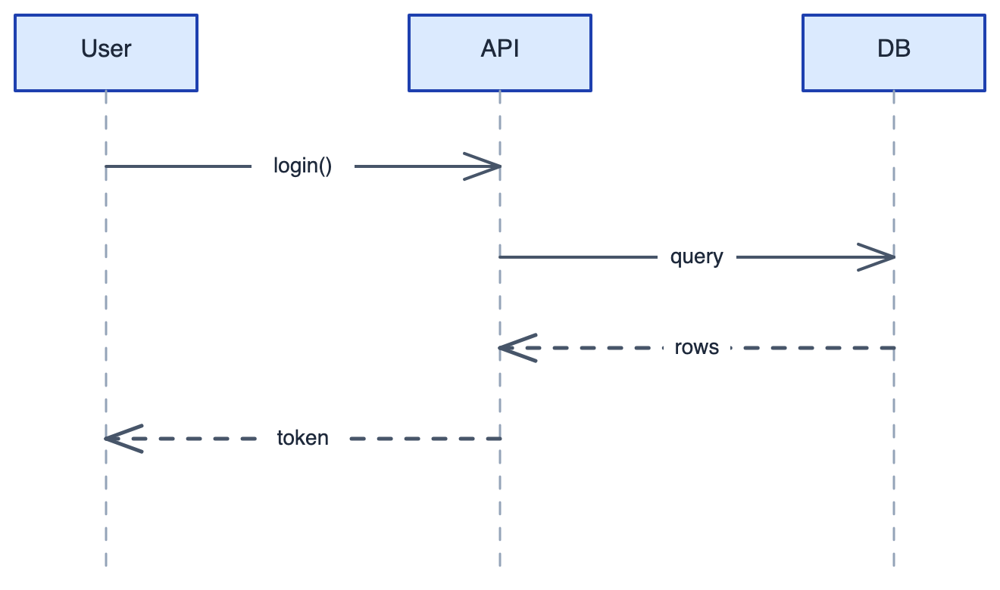
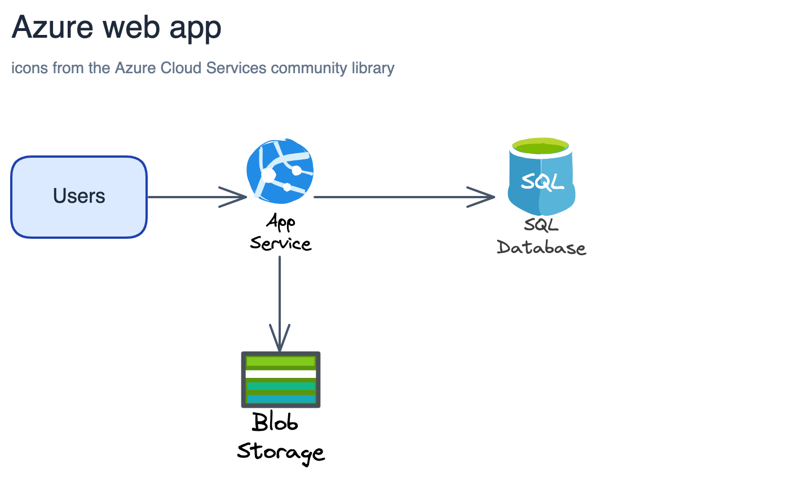
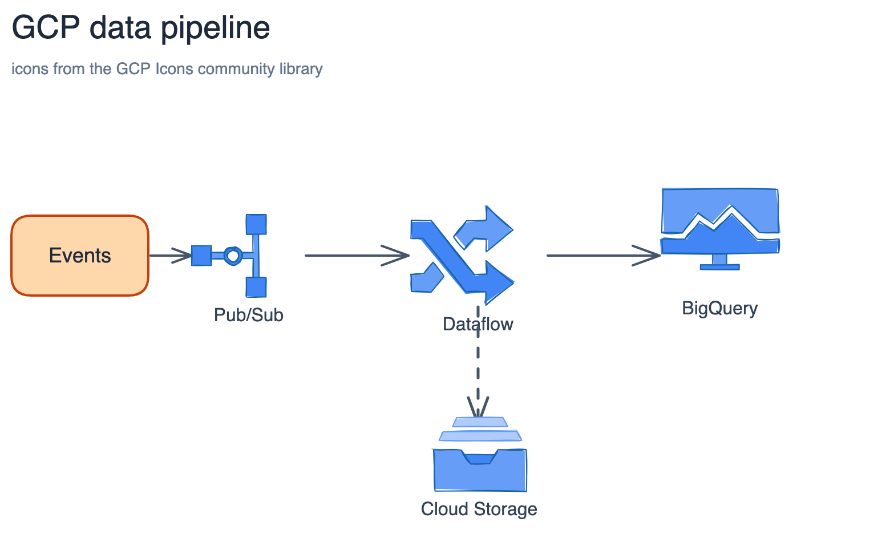
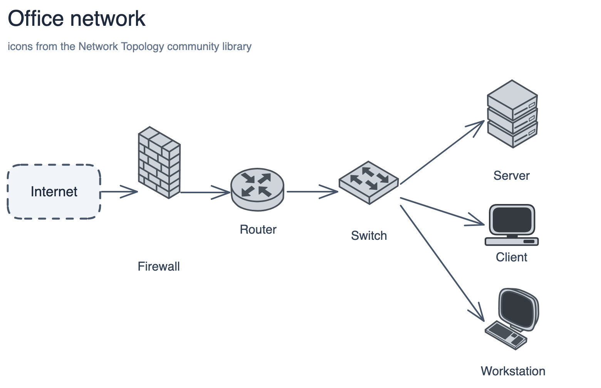
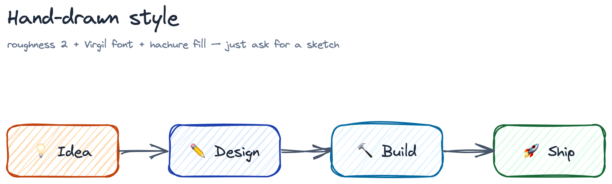
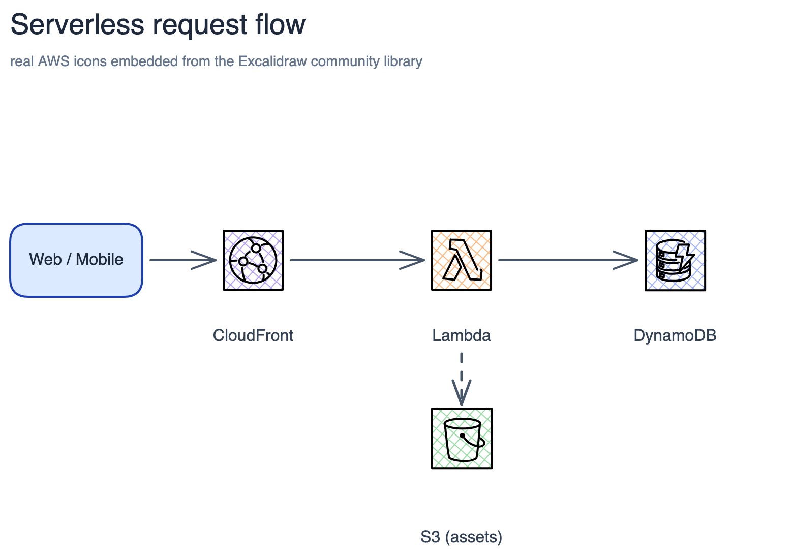
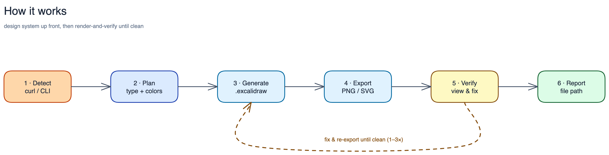

# excalidraw-skill — Clean & Hand-Drawn Diagrams from Natural Language

[](LICENSE)
[](https://github.com/Agents365-ai/excalidraw-skill/stargazers)
[](https://github.com/Agents365-ai/excalidraw-skill/network/members)
[](https://github.com/Agents365-ai/excalidraw-skill/releases/latest)
[](https://github.com/Agents365-ai/excalidraw-skill/commits/main)

[](https://skillsmp.com/skills/agents365-ai-excalidraw-skill-skills-excalidraw-skill-skill-md)
[](https://clawhub.ai/agents365-ai/excalidraw-skill)
[](https://github.com/Agents365-ai/365-skills)
[](https://agentskills.io)
[](https://discord.gg/79JF5Atuk)

**English** · [中文](README_CN.md) · [📖 Online Docs](https://agents365-ai.github.io/excalidraw-skill/)

A skill that turns natural-language descriptions into clean, professional `.excalidraw` JSON files — or hand-drawn sketches when you want them — and exports them to PNG / SVG, either via the zero-install [Kroki](https://kroki.io) API or the local [`excalidraw-brute-export-cli`](https://www.npmjs.com/package/excalidraw-brute-export-cli). Works with **Claude Code, Cursor, Copilot, OpenClaw, Codex, Hermes**, and any agent compatible with the [Agent Skills](https://agentskills.io) format.

<p align="center">
  
</p>

## ✨ Highlights

- **Built-in design system** — 8-category semantic color palette, 5-level font hierarchy, and the 60-30-10 whitespace rule
- **5 diagram patterns** — Flowchart, Architecture, Sequence, Mind Map, Swimlane — each with dedicated spacing and routing rules
- **3 arrow routing modes** — straight, L-shaped elbow, and curved waypoint routing for clean connections
- **Smart CJK-aware sizing** — width auto-derived from label text (`max(160, charCount × 9)`, doubled for CJK) so labels never truncate
- **Anti-pattern guard rails** — short-arrow label collisions, zone text overlap, spaghetti arrows, container opacity rules — all documented inside SKILL.md so the agent dodges them
- **200+ community icon libraries** — drop real AWS / Azure / GCP / network / UML / BPMN icons straight into a scene (they're vector, so they render through the export path) via a bundled helper
- **Two export backends** — `curl` → Kroki API (zero install, SVG) or local Firefox-based CLI (PNG + SVG, works offline)
- **Render-and-verify loop** — exports a PNG, *views it*, and fixes clipping / overlap / mis-routed arrows before delivery — because you can't judge a diagram from JSON
- **Iterative review loop** — once the render is clean, shows you the result and applies targeted edits on your feedback, re-exporting until approved (5-round safety valve)

## 🖼️ Examples

> [!TIP]
> **The hero image above was generated from this single prompt:**

```
Create a microservices e-commerce architecture with Mobile/Web/Admin clients,
API Gateway, Auth/User/Order/Product/Payment services, Kafka message queue,
Notification service, and User DB / Order DB / Product DB / Redis Cache /
Stripe API
```

Beyond the architecture hero above, the same skill spans clean box-and-line classics, **real icons pulled from community libraries**, and **hand-drawn sketches** — all from natural language, every one **verified by actually rendering it**:

<table>
  <tr>
    <td align="center" width="50%"><b>Flowchart</b><br/>ellipse start/end, diamond decisions, Yes/No branches, elbow routing<br/></td>
    <td align="center" width="50%"><b>Sequence</b><br/>participants, dashed lifelines, solid request / dashed response arrows<br/></td>
  </tr>
  <tr>
    <td align="center"><b>Azure web app</b> · <i>community icons</i><br/>real App Service / SQL Database / Blob Storage icons<br/></td>
    <td align="center"><b>GCP data pipeline</b> · <i>community icons</i><br/>Pub/Sub → Dataflow → BigQuery, with a Cloud Storage sink<br/></td>
  </tr>
  <tr>
    <td align="center"><b>Network topology</b> · <i>community icons</i><br/>Cisco-style firewall, router, switch fanning out to hosts<br/></td>
    <td align="center"><b>Hand-drawn</b> · <i>sketch style</i><br/>roughness + Virgil font + hachure fill + emoji icons<br/></td>
  </tr>
</table>

## 🎨 Design System

Output looks deliberate, not random, because every diagram is built on a consistent design system. Before laying anything out, the skill maps **the relationship in your idea** to a visual *metaphor* — the metaphor drives the diagram's shape more than the type label does:

| Relationship | Visual metaphor | Built with |
|---|---|---|
| One → many (broadcast, dispatch) | Fan-out | one node, arrows radiating outward |
| Many → one (aggregate, merge) | Convergence | several inputs, arrows into one node |
| Parent → children (hierarchy) | Tree | trunk + branch lines, free-floating text |
| Repeating cycle (loop, feedback) | Cycle | nodes in a ring, curved arrows back to start |
| Input → transform → output | Assembly line | left-to-right pipeline of steps |
| A vs B (comparison) | Side-by-side | two parallel columns on a shared baseline |
| Before / after, phase break | Gap | whitespace or a dashed divider between groups |
| Fuzzy / overlapping state | Cloud | overlapping ellipses, no hard borders |

A timeline becomes a baseline + dots; a hierarchy becomes lines + text — structure and typography carry the meaning, so filled boxes are reserved for true components.

<details>
<summary><b>Palette, spacing, arrows &amp; typography</b> — click to expand</summary>

**Semantic color palette** — 8 categories mapped to meaning: Primary (blue), Success (green), Warning (yellow), Error (red), External (purple), Process (sky), Trigger (orange), Neutral (slate). Follows the **60-30-10 rule**: 60% whitespace, 30% primary accent, 10% highlight.

**Font hierarchy** — Title 28px → Header 24px → Label 20px → Description 16px → Note 14px.

**Smart element sizing** — width auto-derived from the label text: `max(160, charCount × 9)` for Latin, `max(160, charCount × 18)` for CJK — so labels never truncate.

**Spacing system**

| Scenario | Spacing |
|----------|---------|
| Labeled arrow gap | 150–200px |
| Unlabeled arrow gap | 100–120px |
| Column spacing (labeled) | 400px |
| Column spacing (unlabeled) | 340px |
| Zone padding | 50–60px |

**Arrow routing** — straight (default), L-shaped elbow (`points` with right angles), and curved waypoint (`roundness: { type: 2 }`).

**Arrow semantics** — solid = primary flow, dashed = response / async, dotted = optional / weak dependency.

**Anti-pattern guard rails** — zone-text centering traps, cross-zone arrow spaghetti, label collisions on short arrows, and container opacity rules are all documented inside SKILL.md, so the agent dodges them before they happen.

</details>

## 🚀 Installation

### 1. Pick an export backend

| Backend | Install | Output | Notes |
|---------|---------|--------|-------|
| **Kroki API** | `curl --version` | SVG | Zero install — pre-installed on macOS / Linux / Git Bash / WSL |
| **Local CLI** | `npm install -g excalidraw-brute-export-cli && npx playwright install firefox` | PNG + SVG | Required for PNG; runs offline |

<details>
<summary><b>macOS one-time patch for the local CLI</b> — click to expand</summary>

The CLI presses `Control+O` / `Control+Shift+E`, but macOS needs `Meta` (Cmd). Apply once after installing the CLI (Windows and Linux need no extra step):

```bash
CLI_MAIN=$(npm root -g)/excalidraw-brute-export-cli/src/main.js
sed -i '' 's/keyboard.press("Control+O")/keyboard.press("Meta+O")/' "$CLI_MAIN"
sed -i '' 's/keyboard.press("Control+Shift+E")/keyboard.press("Meta+Shift+E")/' "$CLI_MAIN"
```

</details>

### 2. Install the skill

```bash
# Any agent (Claude Code, Cursor, Copilot, ...)
npx skills add Agents365-ai/365-skills -g
```

```text
# Claude Code plugin marketplace
> /plugin marketplace add Agents365-ai/365-skills
> /plugin install excalidraw
```

```bash
# Manual install
git clone https://github.com/Agents365-ai/excalidraw-skill.git \
  ~/.claude/skills/excalidraw-skill
```

Also indexed on [SkillsMP](https://skillsmp.com/skills/agents365-ai-excalidraw-skill-skills-excalidraw-skill-skill-md) and [ClawHub](https://clawhub.ai/agents365-ai/excalidraw-skill).

## ⚡ Quick Start

After installation, just describe what you want — for example, a system design sketch:

```
Sketch a CI/CD pipeline for a Python web app: developer pushes to GitHub,
triggers GitHub Actions running lint, unit tests, and a security scan in
parallel, then builds a Docker image, pushes to GHCR, and deploys to staging
via ArgoCD with a manual promotion gate to production.
```

The skill picks the right diagram pattern, applies the semantic palette, sizes shapes from the labels, routes the arrows, writes the `.excalidraw` JSON file, and exports to your chosen format.

## 🧩 Supported Diagram Types

| Pattern | Examples | Notable rules |
|---|---|---|
| Architecture | microservices, cloud stacks, network topology, deployment | Column spacing 340–400px, dashed `Neutral` zones at opacity 25–40 |
| Flowchart | business processes, decision trees, state machines | Ellipse start/end, diamond decisions, "Yes" forward / "No" down |
| Sequence | API call flows, RPC traces | 200px between participants, dashed lifelines, dashed = response |
| Mind Map | brainstorms, topic breakdowns | Radial layout, 4 size tiers (200→90px) by depth, lines (not arrows) |
| Swimlane | cross-team handoffs, multi-actor processes | Transparent dashed lanes, free-standing 28px lane labels, LR flow |

Each pattern's full spacing/routing rules and anti-patterns live in [`SKILL.md`](skills/excalidraw-skill/SKILL.md).

## 🧩 Real icons from community libraries

Plain boxes not enough? The [Excalidraw community libraries](https://libraries.excalidraw.com) (200+ `.excalidrawlib` files — AWS, Azure, GCP, network topology, C4, BPMN, UML, circuits…) are built from the **same vector primitives** this skill exports, so their icons **render through Kroki and the local CLI** — no `image` element, no `files` map. A bundled helper (`scripts/excalidraw_lib.py`) finds a library, lists its items, and merges one into your scene with IDs namespaced and coordinates translated:

```bash
python scripts/excalidraw_lib.py search aws
python scripts/excalidraw_lib.py merge scene.excalidraw \
    slobodan/aws-serverless.excalidrawlib 0 455 257 --scale 0.9 --prefix lambda
```

<p align="center">
  
</p>

> The diagram above embeds real AWS icons (CloudFront, Lambda, DynamoDB, S3) pulled straight from a community library — then render-verified like everything else.

## 🔄 How it works

<p align="center">
  
</p>

> The pipeline diagram above was drawn by the skill itself and passed through the same render-and-verify loop it documents.

1. **Detect dependency** — `curl` (Kroki) or local `excalidraw-brute-export-cli`
2. **Plan** — identify diagram type, pick the matching pattern, choose semantic colors
3. **Generate** — write the `.excalidraw` JSON (section-by-section for 10+ elements; namespaced seeds prevent collisions)
4. **Export** — `curl` to Kroki for SVG, or local CLI for PNG / SVG at 1x–3x scale
5. **Verify the render** — export a PNG, *view it*, fix any clipping / overlap / arrow-through-shape, then re-export (1–3 passes)
6. **Review loop** — show you the result, apply targeted edits on your feedback, re-export until approved (5-round safety valve)
7. **Report** — return the output file path

No MCP server and no background daemon — the design system does the heavy lifting up-front, then a quick render-and-verify pass (export PNG → view → fix) catches what JSON alone can't show.

## 🤔 Why a skill, not an MCP server?

Excalidraw's format is just an array of elements with x/y/width/height — Claude can write it natively. A skill teaches Claude *how* to draw; an MCP server gives Claude *a tool* to draw. When the model can do the job itself, teaching beats tooling — no service to run, no runtime to install, and the model keeps full semantic control over layout.

| Aspect | Skill (this) | MCP Server |
|--------|--------------|------------|
| How it works | Prompt injected into context | Separate running service |
| Generation | Claude writes JSON directly | Code handles JSON generation |
| Flexibility | Free-form, semantic layout | Fixed API parameters |
| Install | Copy one file | Start a service, configure MCP |
| Dependencies | Zero | Node.js / Python runtime |

MCP earns its keep when Claude needs capabilities it *can't* do alone — database access, browser automation, authenticated APIs. Diagram generation is design + JSON writing, which is exactly what LLMs are good at.

## 🆚 Comparison

### vs Native Agent (no skill)

| Feature | Native agent | excalidraw-skill |
|---|---|---|
| Valid `.excalidraw` JSON | ❌ usually invalid / non-interactive | ✅ valid schema, full arrow binding |
| Semantic color palette | random / inconsistent | ✅ 8-category palette + 60-30-10 rule |
| Font hierarchy | ad-hoc | ✅ 5-level (28 / 24 / 20 / 16 / 14) |
| Diagram-type presets | ❌ | ✅ 5 patterns with dedicated spacing |
| CJK-aware shape sizing | ❌ truncates Chinese labels | ✅ doubled width for CJK characters |
| Anti-pattern guard rails | ❌ | ✅ zone overlap, spaghetti arrows, label collisions documented |
| One-shot PNG / SVG export | ❌ manual ask | ✅ via Kroki (`curl`) or local CLI |
| Editable output in excalidraw.com | partial | ✅ preserves arrow binding |
| Self-check + review loop | ❌ never looks at the render | ✅ views the PNG, fixes defects, then iterates on your feedback (≤5 rounds) |

### vs Other Excalidraw Skills

The Excalidraw-skill space is crowded. The largest skills — **[coleam00/excalidraw-diagram-skill](https://github.com/coleam00/excalidraw-diagram-skill)** (~3.4k★) and **[yctimlin/mcp_excalidraw](https://github.com/yctimlin/mcp_excalidraw)** (~2k★) — pioneered the render-and-verify loop; this skill adopts it (v1.2.0) while staying zero-install and tuned for the lightweight export path.

| | **excalidraw-skill** (this) | coleam00 (~3.4k★) | mcp_excalidraw (~2k★) | Most others |
|---|---|---|---|---|
| Install footprint | **Zero-install** via Kroki (`curl`); Firefox CLI only for PNG | `uv` + Playwright **Chromium** | Node **MCP server** | varies |
| Runs beyond Claude Code | ✅ any [Agent Skills](https://agentskills.io) agent (Cursor, Copilot, Codex…) | Claude Code | MCP clients | mostly Claude Code |
| Render → view → fix loop | ✅ (v1.2.0) | ✅ (pioneered) | ✅ live canvas | ✗ usually |
| Static-export tuning (edge-to-edge endpoints, arrow-label masking) | ✅ documented & verified | n/a — renders real Excalidraw | n/a — live canvas | ✗ (some advise center-to-center) |
| CJK-aware sizing + bilingual triggers | ✅ | ✗ | ✗ | ✗ |
| Semantic design system (palette, spacing, font tiers) | ✅ | ✅ | partial | varies |
| Output | `.excalidraw` + PNG / SVG | PNG | live canvas + export | varies |

**Where each wins:** coleam00 is the most polished single-diagram generator (Chromium render = pixel-faithful); mcp_excalidraw shines for live, interactive canvas editing. Reach for **this** skill when you want **no heavy runtime** (just `curl`), use **an agent other than Claude Code**, need **bilingual / CJK** diagrams, or want correct output through the **Kroki / CLI export path** that most skills don't account for.

## 🎯 When to use (and when not to)

**Good fit:**
- Hand-drawn / sketchy diagrams — wireframes, mockups, brainstorms, informal architecture
- A friendly, low-fidelity "draft, not final" look (hand-drawn fills, arrows, text)
- Visuals where approachable personality matters more than precision

**Reach for a sibling skill instead when you need:**
- **Polished, precise diagrams, strict UML, or branded vendor icons** → [drawio-skill](https://github.com/Agents365-ai/drawio-skill)
- **Diagrams-as-code in git, auto-laid-out from text** → [mermaid-skill](https://github.com/Agents365-ai/mermaid-skill) (general) or [plantuml-skill](https://github.com/Agents365-ai/plantuml-skill) (UML)
- **An infinite-canvas whiteboard or programmatic freehand strokes** → [tldraw-skill](https://github.com/Agents365-ai/tldraw-skill)

## 🔗 Related Skills

Part of the [Agents365-ai diagram-skill family](https://github.com/Agents365-ai) — pick the right tool for the job:

| Skill | Style | Best for |
|---|---|---|
| [drawio-skill](https://github.com/Agents365-ai/drawio-skill) | Polished, presentation-ready | Architecture, UML, ML/DL diagrams, formal docs |
| [mermaid-skill](https://github.com/Agents365-ai/mermaid-skill) | Text-based, auto-layout | README-embeddable, version-control friendly |
| [plantuml-skill](https://github.com/Agents365-ai/plantuml-skill) | UML-focused | Class / sequence diagrams in CI pipelines |
| [tldraw-skill](https://github.com/Agents365-ai/tldraw-skill) | Whiteboard collaboration | Casual sketches, FigJam-style boards |

## 💬 Community

- **Discord:** https://discord.gg/79JF5Atuk
- **WeChat:** scan the QR code below

<p align="center">
  
</p>

## ❤️ Support

If this skill helps you, consider supporting the author:

<table>
  <tr>
    <td align="center">
      
      <br>
      <b>WeChat Pay</b>
    </td>
    <td align="center">
      
      <br>
      <b>Alipay</b>
    </td>
    <td align="center">
      
      <br>
      <b>Buy Me a Coffee</b>
    </td>
    <td align="center">
      
      <br>
      <b>Give a Reward</b>
    </td>
  </tr>
</table>

## 👤 Author

**Agents365-ai**

- GitHub: https://github.com/Agents365-ai
- Bilibili: https://space.bilibili.com/441831884

## 📄 License

[MIT](LICENSE)
